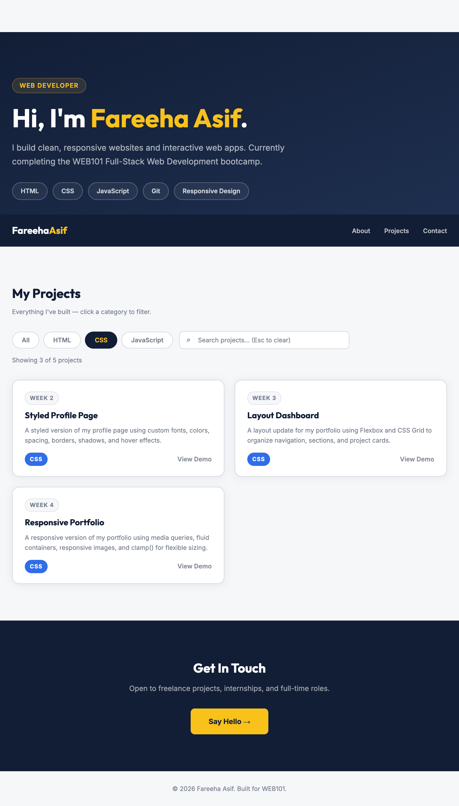
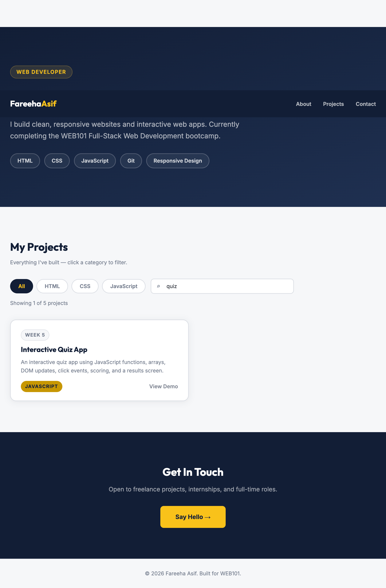
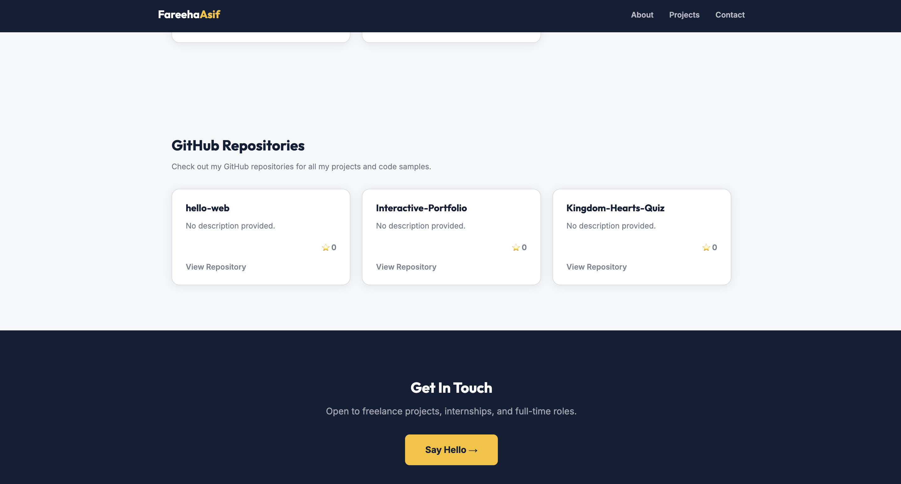

# Interactive Portfolio

## Project Description
This is my Week 6 Interactive Portfolio assignment. The project uses JavaScript to dynamically display portfolio project cards from an array of project objects.

Users can filter the projects by HTML, CSS, or JavaScript, and use the search bar to find projects by title or description.

## GitHub API Integration
This project includes a GitHub Repositories section that fetches my real repositories from the GitHub API using fetch, async/await, and JavaScript DOM rendering.

The repository cards are created with JavaScript, so when I add new public repositories to GitHub, they can appear on the portfolio without hardcoding new cards in the HTML.

## Features
- Dynamic project cards
- Technology filter buttons
- Live search input
- Empty-state message
- Escape key clears the search box

## Technologies Used
- HTML
- CSS
- JavaScript

## Live Link
https://fareehaasif598-cloud.github.io/Interactive-Portfolio/

## Screenshots
### Project Grid With Filter Active 

### Search Returning Results 

### GitHub Repositories Section
